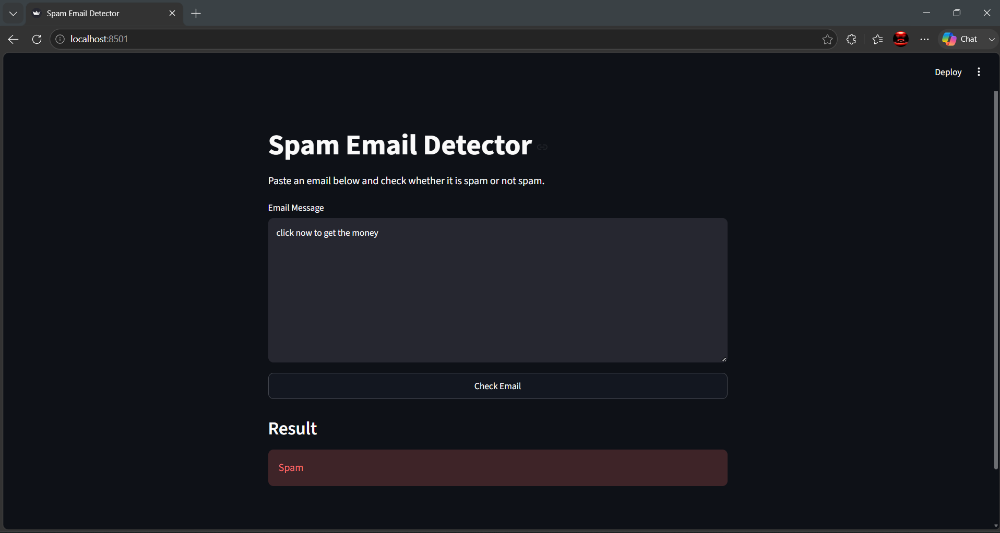
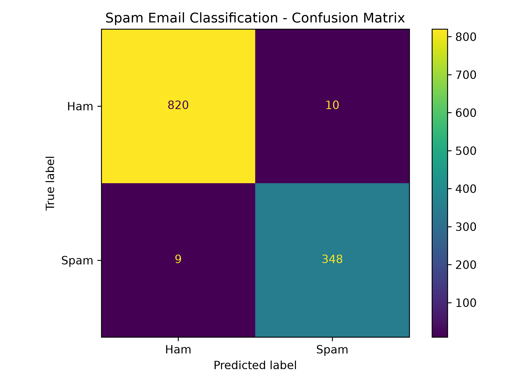
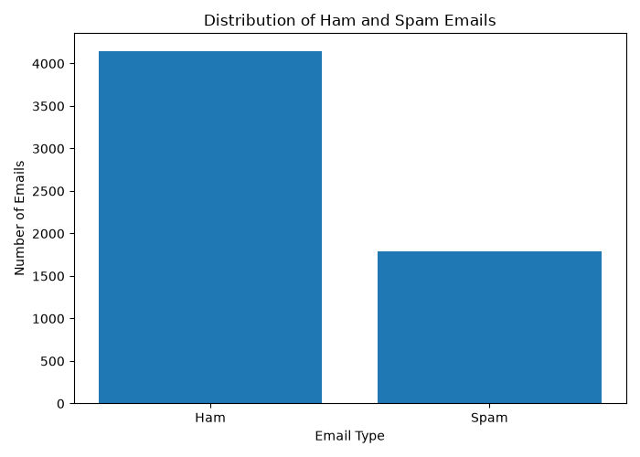

# Spam Email Detector

A machine learning project that classifies email messages as **Spam** or **Not Spam** using Natural Language Processing and Machine Learning.

<p align="center">


</p>

---

## Overview

This project analyzes the text of an email and predicts whether it belongs to the **Spam** or **Ham (Not Spam)** category.

The system follows this pipeline:

**Text Preprocessing → TF-IDF Feature Extraction → Linear SVM → Prediction**

A Streamlit web interface is provided for entering and classifying individual email messages.

---

## Features

- Email dataset loading and exploration
- Text preprocessing using NLTK
- Stopword removal and text cleaning
- TF-IDF feature extraction
- Linear Support Vector Machine classification
- Model evaluation
- Confusion matrix visualization
- Dataset distribution visualization
- Streamlit web application
- Manual email prediction

---

## Application

The project includes a simple web interface for entering an email message and checking its classification.

<p align="center">
  
</p>

---

## Model Performance

The final model uses a **Linear Support Vector Machine (Linear SVM)**.

It was evaluated on **1,187 test emails**.

| Metric | Score |
|---|---:|
| Accuracy | **98.40%** |
| Spam Precision | **97%** |
| Spam Recall | **97%** |
| Spam F1-Score | **97%** |

### Confusion Matrix

<p align="center">
  
</p>

```text
[[820  10]
 [  9 348]]
```

The model correctly classified **348 of 357 spam emails** in the test set.

---

## Dataset

The original dataset contains **6,049 email messages**.

| Category | Number of Emails |
|---|---:|
| Ham | 4,151 |
| Spam | 1,898 |
| **Total** | **6,049** |

### Dataset Distribution

<p align="center">
  
</p>

The dataset contains more Ham emails than Spam emails.

---

## Tech Stack

- **Python** — Core development
- **Pandas** — Data handling
- **NLTK** — Text preprocessing
- **Scikit-learn** — Machine learning and evaluation
- **Matplotlib** — Data visualization
- **Joblib** — Model and vectorizer persistence
- **Streamlit** — Web interface

---

## Project Structure

```text
Spam_Email_Detection/
│
├── model/
│   ├── spam_model.pkl
│   └── tfidf_vectorizer.pkl
│
├── src/
│   ├── load_dataset.py
│   ├── explore_dataset.py
│   ├── preprocess.py
│   ├── train_model.py
│   ├── predict.py
│   ├── evaluate_model.py
│   ├── visualize_dataset.py
│   └── test_predictions.py
│
├── app.py
├── confusion_matrix.png
├── email_distribution.png
├── test_results.csv
├── requirements.txt
├── .gitignore
└── README.md
```

---

## How to Run

### 1. Clone the repository

```bash
git clone https://github.com/Sriharsh-A/spam-email-detection.git
cd spam-email-detection
```

### 2. Create a virtual environment

```bash
python -m venv venv
```

### 3. Activate the virtual environment

**Windows:**

```bash
venv\Scripts\activate
```

### 4. Install dependencies

```bash
pip install -r requirements.txt
```

### 5. Download NLTK resources

Run Python:

```bash
python
```

Then:

```python
import nltk

nltk.download("punkt")
nltk.download("punkt_tab")
nltk.download("stopwords")
```

Exit Python:

```python
exit()
```

### 6. Run the Streamlit application

```bash
streamlit run app.py
```

The application will open in your browser.

---

## Command Line Prediction

Individual email messages can also be tested through the command line:

```bash
python src/predict.py
```

Enter an email message when prompted and the model will return:

```text
Result: SPAM
```

or

```text
Result: NOT SPAM
```

---

## Limitations

The model performs well on the evaluation dataset but may misclassify short or unusual messages that differ significantly from the training data.

This project is a **spam classification system** and does not directly connect to an email inbox or inspect incoming emails in real time.

It is also not a complete phishing or malicious-website detection system.

---

## Future Scope

- Use larger and more diverse email datasets
- Compare additional machine learning algorithms
- Improve text feature extraction
- Handle HTML email content
- Incorporate email headers and metadata
- Improve detection of phishing-related emails
- Integrate with email services for automated classification

---

## Project Status

**Completed**

The machine learning pipeline, model evaluation, command-line prediction system, and Streamlit web application have been implemented successfully.

---

<p align="center">
  Minor project developed during internship
</p>